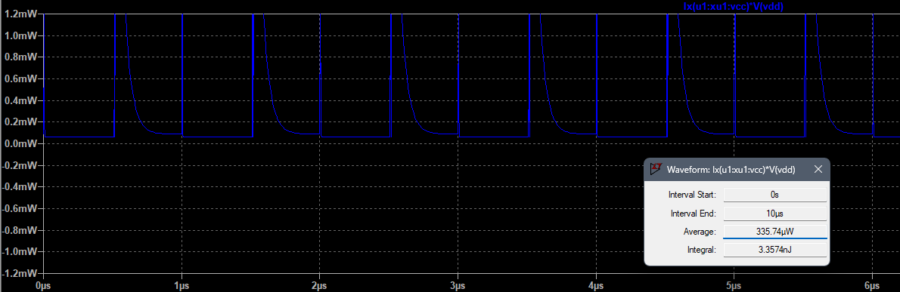
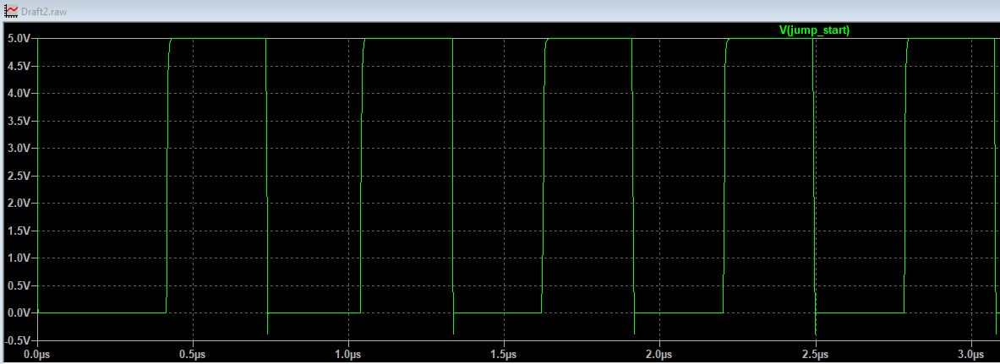

## 7. Estimación del consumo de potencia

### Cálculo teórico — Potencia estática

La **potencia estática** corresponde a la potencia consumida por el dispositivo cuando **no está conmutando** (entradas y salidas en estado lógico constante). Se calcula mediante la expresión:

$P_{estática} = V_{CC} \cdot I_{CC}$

> Donde:
>
> * $V_{CC}$ (o $V_{DD}$ en CMOS) es el voltaje de alimentación.
> * $I_{CC}$ (o $I_{DD}$ en CMOS) es la corriente de alimentación en reposo (quiescent supply current) tomada del datasheet.

#### 1) 74LS04 (TTL)

* Valores extraídos del datasheet:
  * Condiciones de operación tomadas: $V_{CC} = 5\ \text{V}$.
  * **ICCH (typ)** = 1.2 mA  (corriente de alimentación con entradas en nivel alto)
  * **ICCL (typ)** = 3.6 mA  (corriente de alimentación con entradas en nivel bajo)

$P_{estática\_74LS04} = V_{CC} \cdot I_{CCL} = 5\ \text{V} \cdot 3.6\ \text{mA} = 18\ \text{mW}$

Usando ICCH (1.2 mA) se obtendría $P = 6\ \text{mW}$, por lo que el consumo estático típico se encuentra entre **6 mW** y **18 mW** por puerta dependiendo del estado lógico.

Como criterio conservador se elige el **peor caso** (ICCL = 3.6 mA). Entonces la potencia estática por puerta (inversor) es:

$P_{estática\_74LS04} = 18\ \text{mW}$

---

#### 2) CD4069 (CMOS)

* Valor tomado del datasheet en condiciones típicas: **IDD = 1.0 $ \mu A$** (a $V_{DD} = 5\ \text{V}$, 25 °C).

Cálculo:

$P_{estática\_CD4069} = V_{DD} \cdot I_{DD} = 5\ \text{V} \cdot 1.0\times10^{-6}\ \text{A} = 5\ \mu\text{W}$

---

### Cálculo teórico — Potencia dinámica

La potencia dinámica corresponde a la energía consumida cuando las compuertas cambian de estado lógico. La expresión general:

$P_{dinámica} = C_{L} \cdot V_{CC}^{2} \cdot f \cdot \alpha$

> Donde:
>
> * $C_{L}$ es la capacitancia de carga efectiva (datasheet: Cpd o carga externa).
> * $V_{CC}$ o $V_{DD}$ es la tensión de alimentación.
> * $f$ es la frecuencia de conmutación.
> * $\alpha$ es el factor de actividad (para onda cuadrada se asume $\alpha = 0.5$).

#### 1) 74LS04 (TTL)

El datasheet proporciona tiempos de propagación ($t_{pLH} \approx 9\ \text{ns}$) que pueden usarse para estimar una capacitancia equivalente, pero de forma práctica se usa el valor típico de carga dinámica del fabricante. A modo de aproximación, se considera una carga de **10 pF** por salida.

Cálculo para $f = 1\ \text{MHz}$ y $V_{CC} = 5\ \text{V}$:

$P_{dinámica\_74LS04} = 10\ \text{pF} \cdot (5\ \text{V})^{2} \cdot 1\ \text{MHz} \cdot 0.5$

$P_{dinámica\_74LS04} = 0.125\ \text{mW}$

---

#### 2) CD4069 (CMOS)

El datasheet especifica una **capacitancia de potencia (Cpd)** de aproximadamente **12 pF**.

Cálculo para $f = 1\ \text{MHz}$ y $V_{DD} = 5\ \text{V}$:

$P_{dinámica\_CD4069} = 12\ \text{pF} \cdot (5\ \text{V})^{2} \cdot 1\ \text{MHz} \cdot 0.5$

$P_{dinámica\_CD4069} = 0.15\ \text{mW}$

---

### Cuadro comparativo (potencia estática y dinámica, $f = 1\ \text{MHz}$)

| Dispositivo   | VCC / VDD | Corriente (TYP) usada | P_estática (calculada) | P_dinámica (calculada, 1 MHz) |
| ------------- | --------- | --------------------- | ---------------------- | ----------------------------- |
| 74LS04 (TTL)  | 5 V       | 1.2 mA                | **6 mW**               | 0.125 mW                      |
| CD4069 (CMOS) | 5 V       | 1.0 µA                | **5 µW**               | 0.15 mW                       |

## Simulación por medio de LTspice

### Estático — 74LS04 (TTL)

Para medir el consumo **estático** se configuró el circuito de la siguiente forma:

- Alimentación: $V_{CC}=5\ \text{V}$.
- Entrada del inversor: fijada en $A = 0\ \text{V}$.
- Salida: libre (sin carga externa).

**Resultados y analsis:**  
La corriente medida en la fuente fue **24.8 µA** (microamperios), notablemente menor que el valor típico del datasheet para el SN74LS04.

 Esto se puede deber a que el modelo SPICE utilizado prioriza la simulación lógica, sin incluir todas las corrientes internas de polarización. Por ello, la simulación muestra consumos en el rango de µA, mientras que el dispositivo real presenta corrientes de reposo en el orden de mA.

### Estático — CD4069 (CMOS)

Para el caso del **CD4069**, el procedimiento fue similar:

- Alimentación: $V_{DD}=5\ \text{V}$ (con $V_{SS}=0\ \text{V}$).  
- Entrada del inversor: fijada en $A = 0\ \text{V}$ (nivel lógico bajo).  
- Salida: libre (sin carga externa).  

**Resultados y análisis:**  
La corriente medida en la fuente resultó prácticamente **nula (95.2 nA)** en la simulación, lo cual es coherente con la naturaleza CMOS, donde el consumo estático ideal es cercano a cero. Aun así, el valor obtenido es menor al teórico calculado.

Esto confirma que, en reposo, la tecnología CMOS presenta un consumo estático despreciable comparado con la lógica TTL, aunque los valores simulados no concuerdan con los teóricos, resultando mucho menores, como si LTspice no tuviera en cuenta este parámetro.

### Dinámico — 74LS04 (TTL)

Para la potencia **dinámica** en el 74LS04 se configuró el inversor en LTspice de la siguiente forma:

- Alimentación: $V_{CC} = 5\ \text{V}$.  
- Entrada: señal cuadrada de $1\ \text{MHz}$, generada con una fuente PULSE.  
- Salida: conectada a una carga capacitiva de **10 pF** a tierra, representando la carga típica de salida.

**Resultados y Análisis:**  
- Potencia medida en simulación: **0.335 mW**.

El valor simulado resulta mayor al calculado teóricamente (0.335 mW vs. 0.125 mW). 

---

### Dinámico — CD4069 (CMOS)

Para el **CD4069**, el montaje fue equivalente:

- Alimentación: $V_{DD} = 5\ ext{V}$.
- Entrada: señal cuadrada de $1\ ext{MHz}$ (fuente PULSE).
- Salida: carga capacitiva de **12 pF** conectada a tierra (se usó la $C_{pd}$ especificada en el datasheet para aproximar la carga efectiva).

**Resultados y Análisis:**
- Potencia medida en simulación: **0.331 mW**.

El valor simulado (**0.331 mW**) está por encima del cálculo teórico. 

El consumo de potencia depende tanto de la **frecuencia de operación** como de la **tecnología utilizada**. En **TTL (74LS04)** existe un consumo estático apreciable incluso en reposo, al que se suma una componente dinámica que crece aproximadamente de forma lineal con la frecuencia, debido a corrientes de conmutación internas y a la carga capacitiva. En cambio, en **CMOS (CD4069)** el consumo estático es prácticamente nulo y la potencia total está dominada por la componente dinámica, que sigue la relación:
$$
P \approx C \cdot V^2 \cdot f
$$

 Por ello, a bajas frecuencias CMOS es mucho más eficiente que TTL, mientras que a altas frecuencias el consumo de ambas tecnologías aumenta, siendo mayor en la que presente mayor capacitancia efectiva o tiempos de transición más largos.

---
### Oscilador en anillo basado en compuertas NOT

El **oscilador en anillo** es un circuito digital que genera una señal periódica a partir de un número **impar** de inversores (compuertas NOT) conectados en serie y realimentados en un lazo cerrado. La oscilación surge porque cada inversor introduce un **retardo de propagación** $(t_{pd})$ en la transición de la señal, lo cual impide que el sistema alcance un estado estable. Como resultado, el valor lógico se propaga alrededor del anillo generando una onda cuadrada en las salidas.

La frecuencia de oscilación puede aproximarse mediante:

$$
f \approx \frac{1}{2 \cdot N \cdot t_{pd}}
$$

donde \(N\) es el número de inversores en el anillo. Este tipo de oscilador es común en circuitos integrados CMOS, ya que su simplicidad lo hace útil como **generador de reloj**, para caracterizar **tiempos de propagación** o como base de osciladores controlados por tensión (VCO).

## Simulación del oscilador en anillo (CMOS)

El oscilador en anillo se construyó en LTspice utilizando **3 inversores CMOS (CD4069)** conectados en serie, con la salida del último inversor realimentada a la entrada del primero. Se eligió un número impar de etapas para asegurar la inestabilidad lógica y, con ello, la generación de oscilaciones.

- Alimentación: $V_{DD} = 5\ \text{V}$  
- Número de inversores: $N = 3$  
- Carga: capacitores de **10 pF** en cada salida para representar la carga efectiva  
- Condición inicial: se aplicó `.ic V(n1)=5` en uno de los nodos, con el fin de romper la simetría inicial y permitir que el oscilador arrancara.

### Resultados y Análisis 

La salida de cada inversor muestra una onda cuadrada con desfase entre etapas, lo que confirma el comportamiento esperado del oscilador. La frecuencia de oscilación medida fue de aproximadamente **1.6 MHz** (8 pulsos en 5 micro segundos).

El circuito logra oscilar de manera autónoma gracias al retardo de propagación intrínseco de las compuertas CMOS.

