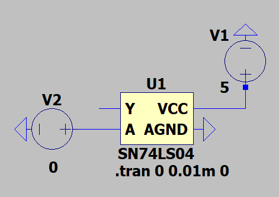
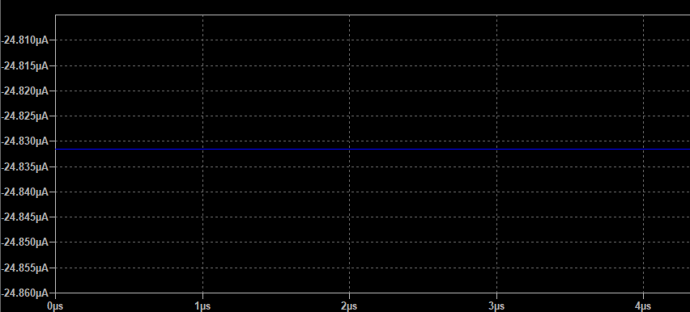
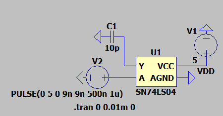
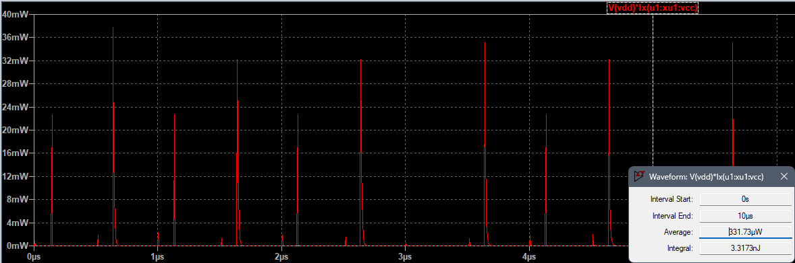

## 7. Estimación del consumo de potencia

### Cálculo teórico — Potencia estática

La **potencia estática** corresponde a la potencia consumida por el dispositivo cuando **no está conmutando** (entradas y salidas en estado lógico constante). Se calcula mediante la expresión:

$P_{estática} = V_{CC} \cdot I_{CC}$

> Donde:
>
> * $V_{CC}$ (o $V_{DD}$ en CMOS) es el voltaje de alimentación.
> * $I_{CC}$ (o $I_{DD}$ en CMOS) es la corriente de alimentación en reposo (quiescent supply current) tomada del datasheet.

#### 1) 74LS04 (TTL)

* Valores extraídos del datasheet:
  * Condiciones de operación tomadas: $V_{CC} = 5\ \text{V}$.
  * **ICCH (typ)** = 1.2 mA  (corriente de alimentación con entradas en nivel alto)
  * **ICCL (typ)** = 3.6 mA  (corriente de alimentación con entradas en nivel bajo)

$P_{estática\_74LS04} = V_{CC} \cdot I_{CCL} = 5\ \text{V} \cdot 3.6\ \text{mA} = 18\ \text{mW}$

Usando ICCH (1.2 mA) se obtendría $P = 6\ \text{mW}$, por lo que el consumo estático típico se encuentra entre **6 mW** y **18 mW** por puerta dependiendo del estado lógico.

Como criterio conservador se elige el **peor caso** (ICCL = 3.6 mA). Entonces la potencia estática por puerta (inversor) es:

$P_{estática\_74LS04} = 18\ \text{mW}$

---

#### 2) CD4069 (CMOS)

* Valor tomado del datasheet en condiciones típicas: **IDD = 1.0 $ \mu A$** (a $V_{DD} = 5\ \text{V}$, 25 °C).

Cálculo:

$P_{estática\_CD4069} = V_{DD} \cdot I_{DD} = 5\ \text{V} \cdot 1.0\times10^{-6}\ \text{A} = 5\ \mu\text{W}$

---

### Cálculo teórico — Potencia dinámica

La potencia dinámica corresponde a la energía consumida cuando las compuertas cambian de estado lógico. La expresión general:

$P_{dinámica} = C_{L} \cdot V_{CC}^{2} \cdot f \cdot \alpha$

> Donde:
>
> * $C_{L}$ es la capacitancia de carga efectiva (datasheet: Cpd o carga externa).
> * $V_{CC}$ o $V_{DD}$ es la tensión de alimentación.
> * $f$ es la frecuencia de conmutación.
> * $\alpha$ es el factor de actividad (para onda cuadrada se asume $\alpha = 0.5$).

#### 1) 74LS04 (TTL)

El datasheet proporciona tiempos de propagación ($t_{pLH} \approx 9\ \text{ns}$) que pueden usarse para estimar una capacitancia equivalente, pero de forma práctica se usa el valor típico de carga dinámica del fabricante. A modo de aproximación, se considera una carga de **10 pF** por salida.

Cálculo para $f = 1\ \text{MHz}$ y $V_{CC} = 5\ \text{V}$:

$P_{dinámica\_74LS04} = 10\ \text{pF} \cdot (5\ \text{V})^{2} \cdot 1\ \text{MHz} \cdot 0.5$

$P_{dinámica\_74LS04} = 0.125\ \text{mW}$

---

#### 2) CD4069 (CMOS)

El datasheet especifica una **capacitancia de potencia (Cpd)** de aproximadamente **12 pF**.

Cálculo para $f = 1\ \text{MHz}$ y $V_{DD} = 5\ \text{V}$:

$P_{dinámica\_CD4069} = 12\ \text{pF} \cdot (5\ \text{V})^{2} \cdot 1\ \text{MHz} \cdot 0.5$

$P_{dinámica\_CD4069} = 0.15\ \text{mW}$

---

### Cuadro comparativo (potencia estática y dinámica, $f = 1\ \text{MHz}$)

| Dispositivo   | VCC / VDD | Corriente (TYP) usada | P_estática (calculada) | P_dinámica (calculada, 1 MHz) |
| ------------- | --------- | --------------------- | ---------------------- | ----------------------------- |
| 74LS04 (TTL)  | 5 V       | 1.2 mA                | **6 mW**               | 0.125 mW                      |
| CD4069 (CMOS) | 5 V       | 1.0 µA                | **5 µW**               | 0.15 mW                       |

## Simulación por medio de LTspice

### Estático — 74LS04 (TTL)

Para medir el consumo **estático** se configuró el circuito de la siguiente forma:

- Alimentación: $V_{CC}=5\ \text{V}$.
- Entrada del inversor: fijada en $A = 0\ \text{V}$.
- Salida: libre (sin carga externa).

**Resultados y analsis:**  
La corriente medida en la fuente fue **24.8 µA** (microamperios), notablemente menor que el valor típico del datasheet para el SN74LS04.

 Esto se puede deber a que el modelo SPICE utilizado prioriza la simulación lógica, sin incluir todas las corrientes internas de polarización. Por ello, la simulación muestra consumos en el rango de µA, mientras que el dispositivo real presenta corrientes de reposo en el orden de mA.

### Estático — CD4069 (CMOS)

Para el caso del **CD4069**, el procedimiento fue similar:

- Alimentación: $V_{DD}=5\ \text{V}$ (con $V_{SS}=0\ \text{V}$).  
- Entrada del inversor: fijada en $A = 0\ \text{V}$ (nivel lógico bajo).  
- Salida: libre (sin carga externa).  

**Resultados y análisis:**  
La corriente medida en la fuente resultó prácticamente **nula (95.2 nA)** en la simulación, lo cual es coherente con la naturaleza CMOS, donde el consumo estático ideal es cercano a cero. Aun así, el valor obtenido es menor al teórico calculado.

Esto confirma que, en reposo, la tecnología CMOS presenta un consumo estático despreciable comparado con la lógica TTL, aunque los valores simulados no concuerdan con los teóricos, resultando mucho menores, como si LTspice no tuviera en cuenta este parámetro.

### Dinámico — 74LS04 (TTL)

Para la potencia **dinámica** en el 74LS04 se configuró el inversor en LTspice de la siguiente forma:

- Alimentación: $V_{CC} = 5\ \text{V}$.  
- Entrada: señal cuadrada de $1\ \text{MHz}$, generada con una fuente PULSE.  
- Salida: conectada a una carga capacitiva de **10 pF** a tierra, representando la carga típica de salida.

**Resultados y Análisis:**  
- Potencia medida en simulación: **0.335 mW**.

El valor simulado resulta mayor al calculado teóricamente (0.335 mW vs. 0.125 mW). 

---

### Dinámico — CD4069 (CMOS)

Para el **CD4069**, el montaje fue equivalente:

- Alimentación: $V_{DD} = 5\ ext{V}$.
- Entrada: señal cuadrada de $1\ ext{MHz}$ (fuente PULSE).
- Salida: carga capacitiva de **12 pF** conectada a tierra (se usó la $C_{pd}$ especificada en el datasheet para aproximar la carga efectiva).

**Resultados y Análisis:**
- Potencia medida en simulación: **0.331 mW**.

El valor simulado (**0.331 mW**) está por encima del cálculo teórico. 

---
